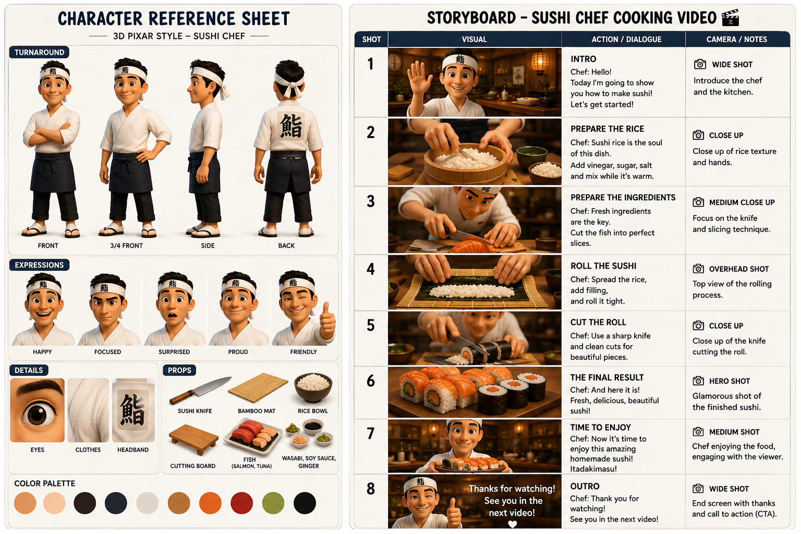

# Storyboard Skill

A collection of AI skills for generating infographic storyboard posters and video prompts for short-form video content (under 60 seconds).

## What's inside

This repo contains two skills targeting different AI platforms:

### 1. Storyboard Poster Skill — Claude

A Claude Code custom skill that builds prompt sets for image-generation and video-generation AIs.

**What it produces:**

| Block | Description | When |
|---|---|---|
| Character Reference Sheet | A single landscape poster with hero pose, turnarounds, detail crops, expression chart, and footer | On request only |
| Storyboard Poster Prompt | A complete 16:9 infographic storyboard prompt with scene-by-scene panels, cinematography notes, header/footer | Always |
| Video Prompt | A concise prompt for AI video apps (Seedance, Kling, Runway, Pika) with per-scene camera and action descriptions | Always |

**Supported video types:** Food/Cooking · Character Showcase · Product Showcase · Process/How-It-Works

**Language versions:**
- [English](storyboard-skill-en.md)
- [Tiếng Việt](storyboard-skill-vn.md)

### 2. Storyboard ChatGPT Executor Skill — ChatGPT

A ready-to-paste ChatGPT system prompt that interviews the user, then **directly generates images** via DALL·E — no copy-pasting prompts needed.

**What it produces inside ChatGPT:**
1. **Character Reference Sheet image** — a single cohesive poster with hero pose, turnarounds, detail crops, expression chart
2. **Storyboard Poster image** — a 16:9 infographic with panel grid, header, footer, and camera notes
3. **Video Prompt text** (optional) — for Kling, Runway, Seedance, or Pika

**Language versions:**
- [English](storyboard-chacracter-ref-chatgpt-en.md)
- [Tiếng Việt](storyboard-chacracter-ref-chatgpt-vn.md)

**How to use:** Copy the entire block from the skill file and paste it into ChatGPT (system prompt for Plus/Custom GPT, or first message for free tier).

## Example output

### Storyboard poster

### Generated video

<video src="output-video.mp4" controls width="100%"></video>

> Result from pasting the generated prompts into an image-gen AI and a video-gen AI.

## How to use

### ChatGPT skill

1. In ChatGPT, create a **new Project**
2. Paste the entire content from [storyboard-chacracter-ref-chatgpt-en.md](storyboard-chacracter-ref-chatgpt-en.md) (or the [Vietnamese version](storyboard-chacracter-ref-chatgpt-vn.md)) into the project's **system prompt / Instructions** field
3. Start a new chat inside the project and describe your video concept
4. ChatGPT will interview you briefly, then generate the Character Reference Sheet and Storyboard Poster images directly via DALL·E — no copy-pasting prompts needed

### Claude Code skill

1. Open Claude Code and give it the skill file: "Use [storyboard-skill-en.md](storyboard-skill-en.md) (or the [Vietnamese version](storyboard-skill-vn.md)) to create a skill"
2. Claude Code will register it as a custom skill
3. Trigger the skill by mentioning: storyboard, shot breakdown, scene planning, video prompt, short video, reel planning, shooting script, shot list, or asking to visualize a video concept scene by scene
4. Claude will output text prompts you can paste into image-generation AIs (Midjourney, DALL·E, etc.) and video-generation AIs (Seedance, Kling, Runway, Pika)
